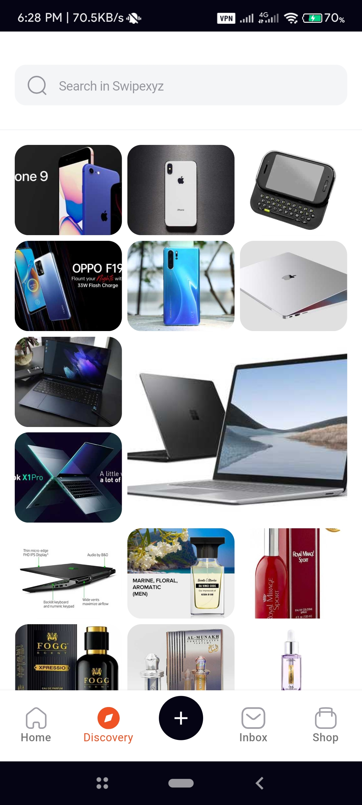
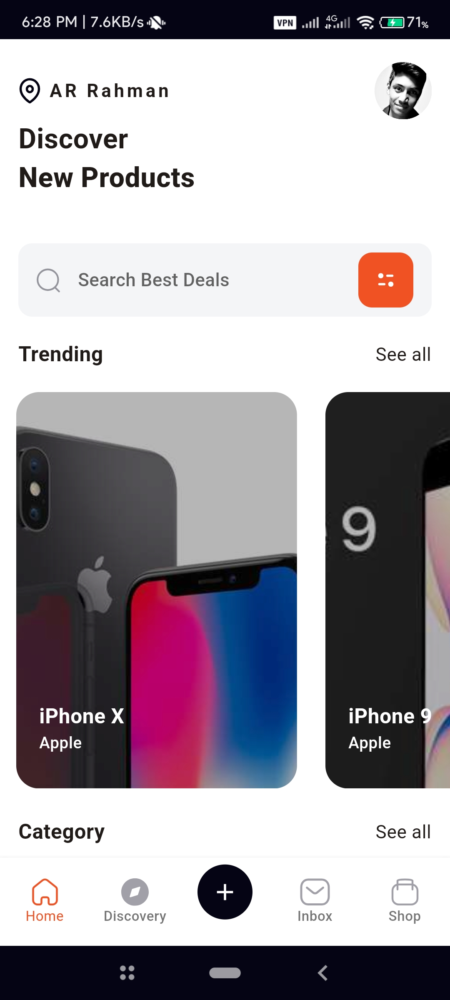
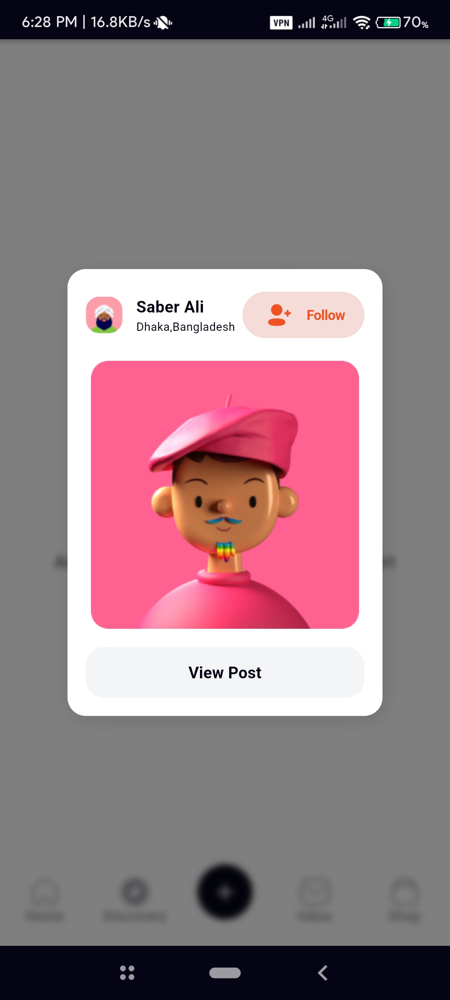

# GetX ShopApp Challange


## Getting Started

1. Clone the repository:

```
git clone https://github.com/arrahmanbd/getx_shopapp.git
```

2. Open the project in your preferred IDE, such as Android Studio or Visual Studio Code.

3. Install the required dependencies:

```
flutter pub get
```
4. Run the project:

## Features

1. Rest API Implemented.
2. Use GetX State Management.
3. Architecture with GexCli.
4. Implemented Flutter Animations.
5. Implemented Dynamic Grid View.
6. Dynamic Error Handeling.

## Screenshot









## Test Apk
[](https://drive.google.com/file/d/1X6vjQMRHvvKflGGQI65VRsv0wi0U9qLP/view?usp=drivesdk)


## 🔗 Follow
[](https://arrahmanbd.github.io/)
[](https://www.linkedin.com/in/arrahmanbd)
[](https://www.github.com/arrahmanbd)

## License

This project is licensed under the MIT License - see the [LICENSE](LICENSE) file for details.
